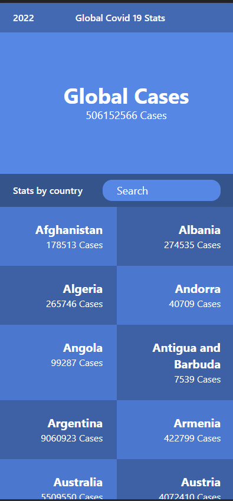

# Covid stats

> #### A web application for a company whcih provides commercial and scientific space travel services. In this application users can book rockets and join the space missions useing live data from the spaceX API.

## Built With

- React.js
- Redux (@redux/toolkit)
- React-Bootstrap

## Additional Used

- Api
- KanbanBoard
- Linters
- Gitflow
- npm

## Getting Started

To get a local copy up and running follow these simple example steps.

`git clone git@github.com:miftah1991/space-travelers.git `

Then `cd space-travelers`

Then `npm install` to install packages

Finally `npm start`

## Authors

👤 **Mohamed Eldeeb**

- GitHub: [@eng-mohamed-eldeeb](https://github.com/eng-mohamed-eldeeb)
- LinkedIn: [LinkedIn](https://www.linkedin.com/in/mohamed-eldeeb-a69022206/)

## 🤝 Contributing

Contributions, issues, and feature requests are welcome!

Feel free to check the [issues page](../../issues/).

## Live Demo

- [live demo to see the Covid Stats](https://exquisite-kringle-86789b.netlify.app/)

## Site Screenshots

## Show your support

Give a ⭐️ if you like this project!

## 📝 License

This project is [MIT](./MIT.md) licensed.